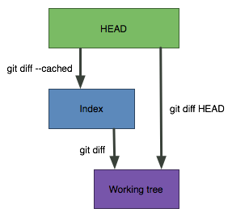
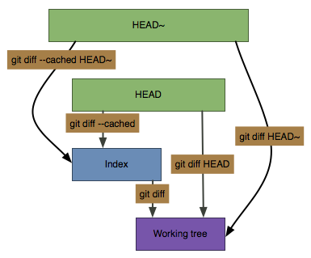

Git (Distributed Version Control System - DVCS)
===============================================

## Types of diff

From [StackOverflow](https://stackoverflow.com/a/8452932).

There are three types of _diff_ you can ask for:



1. `git diff --cached` The diff between what is in the index and the last commit.
   It shows you changes that will be in the next commit.

2. `git diff` The diff between the index and the working tree.
    These are the changes that you have made to files since you last added them to the index.

3. `git diff HEAD` The diff between the files in the working tree and the last commit.
   There is a gotcha here: if you've made changes, added them to the index,
   and then removed these changes in the working tree:
    
   - you'll get no results for `git diff HEAD`, because there is no difference,
   - you'll get output for `git diff --cached`, because there are still changes in the index.

Comparing against previous commit (`HEAD~1`):



`HEAD~` can be replaced with any other reference to a commit one wants to compare against.

## Searching for commits

### Yet to be applied to upstream

    $ git cherry -v local local_old | grep ^\+

> **NOTE**
> 
> The equivalence test is based on the _diff_,
> after removing whitespace and line numbers.

## Edit commit

    $ git rebase -i HEAD~3

## Cherry-pick from another repo, _without adding it_ as remote first

    $ cd path/to/current/repo
    $ git --git-dir=/path/to/another/repo/.git format-patch -k -1 --stdout <commit> \
          | git am -3 -k

## Graphical log (adog)

_A dog:_

    $ git log --all --decorate --oneline --graph

## Files and objects inspection

### Show full contents of a file as if the staged changes were applied

    $ git show :path/to/the/file

> **NOTE**
>
> Note the colon ":" in front of the file path.
> Note that placing "--" before the path does not work as a separator here.

## Print commit message of a given commit hash

    $ git log -1 --format=%B <COMMIT>

## Print the names of files changed in a given commit

    $ git log -1 --pretty= --name-only <COMMIT>

## Stashing

### Stash everything except index (i.e. staged/cached changes)

    $ git stash push -k -u

### Checkout tracked path from stash

    $ git checkout stash@{0} -- README

### Checkout untracked path from stash

See [here](https://stackoverflow.com/a/23609023) for details.

    $ git checkout stash@{0}^3 -- untracked/file.txt

### Compare index with a stash

    $ git diff --cached stash@{0} -- README

## Reset author for all commits

```
git filter-branch -f --env-filter "
    GIT_AUTHOR_NAME='New Name'
    GIT_AUTHOR_EMAIL='new@email'
    GIT_COMMITTER_NAME='New Name'
    GIT_COMMITTER_EMAIL='new@email'
  " HEAD
```

## Inject commit in-between other commits

1. Find the commit the new commit should be injected _after_:

       $ git rebase -i HEAD~3

2. Choose `edit`.
3. Make changes and do `git commit`, but without `--amend`.
4. `git rebase --continue`.

## Split a commit

> **IMPORTANT**
>
> Save the original commit's message before `reset`,
> since it will be lost otherwise.

Start an interactive rebase:

    $ git rebase -i COMMIT~1

Mark the commit to be split with `edit`.
Then, reset the state to the previous commit:

    $ git reset HEAD~1

Use `git add` and `git commit` to incrementally add changes.
Then resume rebasing:

    $ git rebase --continue

Source: [Embedded Artistry: Workflow for Splitting git Commits](https://tinyurl.com/59jatw8r)

## Working with branches

### Create a branch from a commit

    $ git branch <BRANCH_NAME> <COMMIT>

### Make a branch point to a different commit

    $ git branch -f <BRANCH_NAME> <COMMIT>

## Remotes

### Add/remove a secondary (or alternative) remote

```
$ git remote add alt-remote-name alt-remote-machine:/path/to/repo.git
$ git remote update
$ git pull alt-remote-name master

$ git remote rm alt-remote-name
```

### List remote branches

```
$ git branch -r
```

## Submodules

### Loop over submodules and conditionally execute a command

And test if there are any uncommitted changes in the index.
If there are such changes, execute specified command.
Note that `:` is required, because `foreach` stops upon
first command that returns a non-zero return code.

```
$ git submodule foreach 'git status --porcelain=v1 | \
     ((grep -q -v ^$ && git checkout -b mlgtint-2099_qcsapi_headers) || :)'
```

In the above example, the conditionally executed command is:

    git checkout -b mlgtint-2099_qcsapi_headers
